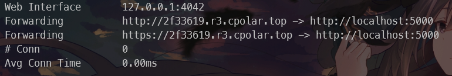

# 成电综测分数计算器

* [构建项目](#构建项目)
* [使用方法](#使用方法)
* [内网透传](#内网透传)

- 在线分数填写功能，提交后自动保存在服务器端，且页面存储填写的数据
- 简单的管理界面，可以查看谁还没有提交。

- 一键计算功能，在全部提交之后点击按钮即可在本地看到排名

- 数据校验，可设置最大最小值，检测空值

## 使用指南

### 构建项目

- 源码构建

  1. 克隆本项目到文件夹下，最好不要有中文

     > git clone https://github.com/FoxSuzuran/ScoreCount-Flask.git

  2. 安装依赖

     > pip install -r requirements.txt

     或者使用poetry，项目里有提供好的`pyproject.toml`配置文件

  3. 在`app.py`目录下运行命令

     > flask run

  4. 查看**使用方法**章节

- 使用构建好的exe文件

  待定

### 使用方法

1. 运行`flask run`后，提示

   > INFO     | app:<module>:12 - 请填写config文件夹下的配置文件后重新启动

   - config/config.json文件

     - admin_name 给班委用的登录后台用户名

     - password 给班委用的登录后台密码

     - score_min 可填写分数最小值（默认1）

     - score_max 可填写分数最小值（默认100）

   - config/data.xlsx文件

     填写本班学生的学号和姓名

   填写完两个文件后重新运行`flask run`

2. `/login`页面

   

   填写自己的学号和姓名后点击登录即可

3. `/score-form`打分界面

   

   给每个学生打完分之后点击提交，如果出现提示`表格数据已成功提交并保存在服务器上。`证明后台已经收到数据，后台数据保存在`data/{学号}.xlsx`

4. `/admin`管理界面

   

   这个界面只能通过地址栏手动改地址进入，填写在config.json配置好的用户名密码即可进入后台

5. `/management`后台界面

   

   管理员登录完自动跳转进入，非管理员无权限进入

   可以查看提交进度，谁没有提交，在全部提交完毕后点击**开始计算**，最终数据保存在`FinalScore`文件夹中

### 内网透传

如果没有内网透传，该服务无法被外部访问，此处使用`cpolar`进行内网透传（也可以使用你喜欢的服务）

1. 注册账号

   打开[cpolar - 安全的内网穿透工具](https://www.cpolar.com/)，注册后进入控制台，跟随使用指南安装配置

2. 使用下面的命令开启一个服务，5000是flask的默认端口，然后你就可以在控制台看到临时域名

   > cpolar http 5000

   

3. 将链接发给你班同学，然后开始愉悦的使用该服务
